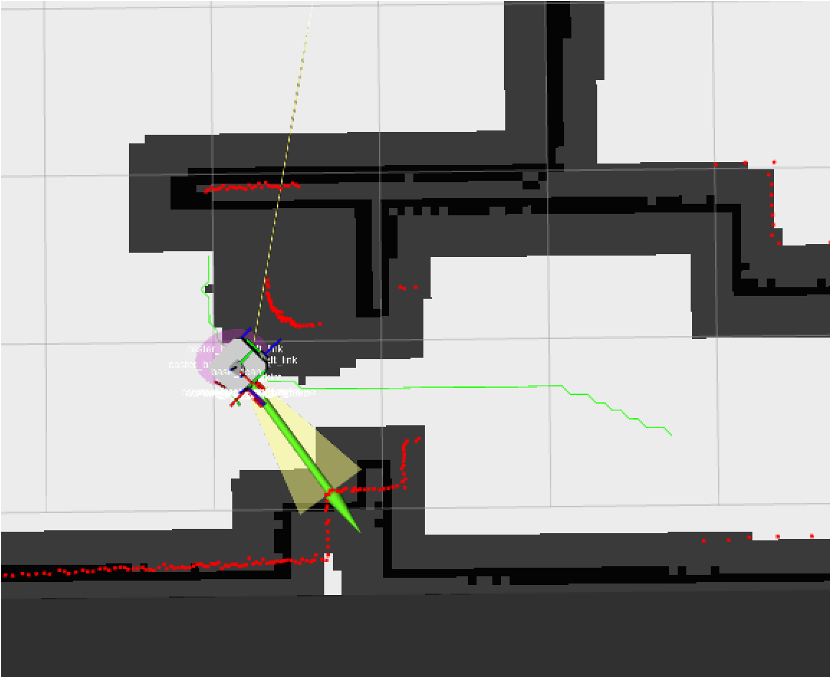

# Autonomous Housekeeping Robot

<p align="center">
  
  
  
  
  
  
</p>

A fully autonomous robot system built on **TurtleBot3 Waffle** and simulated in **Gazebo**, capable of exploring unknown environments, navigating pre-built maps, detecting and avoiding obstacles, and tracking colored objects using computer vision — all orchestrated through a modular ROS2 Python package.

---

## Table of Contents

- [Overview](#overview)
- [System Architecture](#system-architecture)
- [Capabilities](#capabilities)
  - [Task 1 — Autonomous Exploration & Mapping](#task-1--autonomous-exploration--mapping)
  - [Task 2 — Localization & Navigation with Obstacle Avoidance](#task-2--localization--navigation-with-obstacle-avoidance)
  - [Task 2 Bonus — RRT\* Reactive Local Planner](#task-2-bonus--rrt-reactive-local-planner)
  - [Task 3 — Ball Detection & Autonomous Approach](#task-3--ball-detection--autonomous-approach)
- [Key Algorithms](#key-algorithms)
- [MATLAB PID Optimization](#matlab-pid-optimization)
- [Project Structure](#project-structure)
- [Installation & Build](#installation--build)
- [Running the Simulation](#running-the-simulation)
- [Configuration Reference](#configuration-reference)
- [ROS2 Topic Reference](#ros2-topic-reference)
- [Dependencies](#dependencies)

---

## Overview

This project implements a complete autonomous navigation stack for a differential-drive robot operating in a house environment. The system is structured as a proper Python package (`turtlebot3_gazebo`) with shared utility modules, enabling clean separation of concerns between planning, control, sensing, and simulation management.

**Core capabilities:**
- Frontier-based SLAM exploration to build a complete map from scratch
- AMCL-based localization and goal-directed navigation on a pre-built map
- Real-time dynamic obstacle detection, geometry estimation, and costmap integration
- Two-layer planning: A\* global planner + RRT\* reactive local planner
- Computer vision pipeline for colored ball detection, approach, and identification
- MATLAB-optimized PID controller gains with actuator dynamics and sensor noise modeling

---

## System Architecture

```
┌──────────────────────────────────────────────────────────────────────┐
│                     turtlebot3_gazebo Package                        │
│                                                                      │
│  ┌─────────────────────────────────────────────────────────────┐    │
│  │                     Shared Utilities (common/)               │    │
│  │   graph_utils.py     map_utils.py    geometry_utils.py       │    │
│  │   A* / RRT*          Map loading     Coord transforms        │    │
│  │   path planning      & inflation     polar / Euler           │    │
│  │                                      lidar_utils.py          │    │
│  │                                      Scan processing         │    │
│  └─────────────────────────────────────────────────────────────┘    │
│                               ▲                                      │
│              ┌────────────────┼────────────────┐                    │
│              │                │                │                    │
│  ┌───────────┴────┐  ┌────────┴──────┐  ┌──────┴───────────────┐   │
│  │frontier_       │  │global_planner_│  │vision_node.py        │   │
│  │explorer_node   │  │node.py        │  │                      │   │
│  │                │  │               │  │Camera → HSV → Detect │   │
│  │SLAM + Frontier │  │AMCL + A* + PID│  │→ Approach → Identify │   │
│  │exploration     │  │+ Obstacle avoid│  └──────────────────────┘   │
│  └────────────────┘  └───────────────┘                              │
│                                                                      │
│  ┌──────────────────┐  ┌───────────────────┐  ┌──────────────────┐  │
│  │path_follower_    │  │obstacle_detector_ │  │costmap_node.py   │  │
│  │node.py           │  │node.py            │  │                  │  │
│  │PID polar-coord   │  │LiDAR geometry est.│  │Inflated costmap  │  │
│  │path follower     │  │& costmap update   │  │publisher         │  │
│  └──────────────────┘  └───────────────────┘  └──────────────────┘  │
└──────────────────────────────────────────────────────────────────────┘
              │
              ▼
     /cmd_vel → Gazebo → TurtleBot3 Waffle
```

---

## Capabilities

### Task 1 — Autonomous Exploration & Mapping

The robot explores a **completely unknown environment** autonomously, building a map in real time using frontier-based SLAM exploration.

<details>
<summary><b>How it works</b></summary>

1. Subscribes to the live `/map` OccupancyGrid from SLAM Toolbox
2. Identifies **frontier cells** — free cells directly adjacent to unknown cells — using a fast neighbor-scan approach
3. Ranks frontiers by a composite cost function balancing travel distance and information gain
4. Plans a collision-free path to the best frontier using A\* on the inflated live map
5. Follows the path using the PID polar-coordinate path follower
6. Switches to **wall-following** mode when A\* planning fails in narrow corridors
7. Declares exploration complete when fewer than 1% of known cells remain unexplored

**Frontier selection constraints:**
- Requires ≥ 5 free neighbors (avoids trivial single-cell frontiers)
- Minimum distance 0.6 m from robot (avoids targeting the robot's own footprint)
- Inflates wall cells only — unknown cells are left open to allow planning into unexplored space

</details>

**State machine:**
```
IDLE → ASTARPATH_FOLLOWING → RETREATING → WALL_FOLLOWING → MAP_EXPLORED
```

**Mapping demo:**


*Autonomous frontier exploration building the house map from scratch.*

---

### Task 2 — Localization & Navigation with Obstacle Avoidance

The robot navigates a **known pre-built map** to user-defined goals while detecting and avoiding dynamic obstacles not present on the map.

<details>
<summary><b>How it works</b></summary>

1. Loads the pre-built map from `maps/map.yaml` and inflates obstacle cells for clearance
2. Uses **AMCL** (Adaptive Monte Carlo Localization) for robust pose estimation on the known map
3. Accepts navigation goals via RViz (`/move_base_simple/goal`)
4. Plans a global path using A\* and follows it with the PID path follower
5. On obstacle detection (LiDAR range < threshold):
   - **Retreat**: reverses a fixed distance (dual safety zones: front + rear)
   - **Align**: rotates to face the obstacle directly
   - **Estimate**: measures obstacle diameter from LiDAR angular sweep using the chord formula
   - **Update costmap**: marks the obstacle's world-frame footprint on the costmap
   - **Replan**: re-runs A\* to route around the new obstacle
6. Resets dynamic costmap entries after reaching the goal

</details>

**State machine:**
```
IDLE → ASTARPATH_FOLLOWING → RETREATING → ALIGNING_TO_OBS → REPLANNING → ASTARPATH_FOLLOWING
```

**Obstacle avoidance:**



*Robot detecting, estimating, and routing around a dynamic obstacle placed in its path.*

---

### Task 2 Bonus — RRT\* Reactive Local Planner

Extension of Task 2 introducing a **two-layer planning architecture** where a global A\* plan is augmented by an RRT\* local planner that reactively bypasses newly detected obstacles.

<details>
<summary><b>Architecture</b></summary>

```
Global Layer:   A* plans full path from start → goal on the static inflated map
                         │
                         ▼ Robot follows global path
                    Obstacle detected mid-execution
                         │
                   Stop → Estimate obstacle geometry
                   Add obstacle footprint to local costmap
                         │
Local Layer:    RRT* plans bypass segment:
                current_position → reconnect_point (next A* waypoint ahead)
                         │
                Execute RRT* bypass → arrive at reconnect point
                         │
                Replan A* from reconnect_point → final goal
```

</details>

**Why RRT\* as local planner:**
- Operates in continuous space — produces smooth, non-grid-aligned bypass paths
- Asymptotically optimal: rewires the tree to minimize cumulative cost
- Scoped to the local planning area around the obstacle — fast per invocation
- Naturally handles non-convex local obstacle shapes that confuse grid-based replanning

**State machine:**
```
IDLE → ASTARPATH_FOLLOWING → RETREATING → ALIGNING_TO_OBS
     → RRTSTAR_PLANNING → RRTSTAR_FOLLOWING → REPLANNING → ASTARPATH_FOLLOWING
```

---

### Task 3 — Ball Detection & Autonomous Approach

The robot navigates the environment using its RGB camera to detect, approach, and identify colored balls (red, green, blue).

<details>
<summary><b>How it works</b></summary>

**Detection pipeline:**
1. Converts each camera frame to HSV color space
2. Applies per-color HSV masks (with adaptive thresholds for large/close objects)
3. Finds contours and applies a **circularity filter** (threshold > 0.75) to reject bricks and walls
4. Estimates 3D ball position: `distance = (physical_diameter × focal_length) / pixel_diameter`

**Approach pipeline:**
1. Align: rotate to center the detected ball in the frame
2. Navigate: plan an A\* path to an approach waypoint with correct final orientation
3. Re-estimate: refine position at close range using updated mask
4. Identify: determine final color by majority mask vote

**Published topics:** `/bbox`, `/red_pos`, `/blue_pos`, `/green_pos`

</details>

**Ball tracking demo:**


*Robot detecting and approaching all three colored balls.*

---

## Key Algorithms

### A\* Path Planning (`common/graph_utils.py`)

Custom implementation using a binary heap priority queue (`heapq`). Key properties:

- **Heuristic:** Euclidean distance (admissible, consistent)
- **Movement:** 8-directional (cardinal cost = 1.0, diagonal cost = √2)
- **Obstacle handling:** If start or goal falls inside an inflated obstacle cell, the nearest valid free cell within a configurable search radius is substituted
- **Line-of-sight shortcutting:** Before selecting the next waypoint, Bresenham's line algorithm checks if a straight line to the final goal is collision-free — shortcuts directly if clear

```
f(n) = g(n) + h(n)
g(n) = accumulated path cost from start
h(n) = euclidean_distance(n, goal)
```

### RRT\* Local Planner (`common/graph_utils.py`)

Rapidly-exploring Random Tree Star operating on the inflated costmap local to the detected obstacle:

1. **Sample** a random point in the planning area
2. **Extend** tree toward sample, respecting obstacle cells
3. **Rewire** the neighborhood: for each node near the new node, check if routing through the new node reduces cost
4. **Terminate** when a node reaches within tolerance of the target reconnection point

Asymptotic optimality is guaranteed by the rewiring step — paths converge to the true optimal as iterations increase.

### Frontier-Based Exploration (`nodes/frontier_explorer_node.py`)

Frontiers are identified as free cells (value = 0) adjacent to unknown cells (value = −1) in the OccupancyGrid. Ranked by:

```
cost = W_dist × euclidean_distance(robot, frontier)
     + W_power / local_area_gain(frontier)
```

where `local_area_gain` is the fraction of unknown cells in a local window centered on the frontier — rewarding frontiers that are likely to reveal large unexplored areas.

### Obstacle Geometry Estimation (`nodes/obstacle_detector_node.py`)

When an obstacle is detected, the robot aligns to face it, then sweeps the LiDAR to detect the angular span via range-jump detection. Obstacle diameter:

```
L = 2 × R × sin(Δθ / 2)
```

where `R` is the measured range to the obstacle center and `Δθ` is the detected angular span. The world-frame center coordinates are computed from robot pose and bearing, then marked on the costmap with the appropriate inflation radius.

### PID Path Follower — Polar Coordinates (`nodes/path_follower_node.py`)

Converts Cartesian tracking error to polar coordinates (ρ, α, β):

```
ρ     = distance to lookahead point
α     = atan2(Δy, Δx) − θ_robot       (heading error, wrapped to [-π, π])
β     = −θ_robot − α                   (final orientation correction)

v_cmd     = clamp(k_ρ × ρ,  0, v_max)
ω_cmd     = kp × α  +  ki × ∫α dt  +  kd × (dα/dt)  +  k_β × β
```

The β term is only activated near the final goal waypoint to align the robot's heading on arrival.

### Dynamic Lookahead

```
lookahead_dist = v_current × lookahead_ratio + min_lookahead
```

The lookahead point walks ahead of the robot along the path proportionally to current speed, giving smoother tracking at speed while maintaining precision at low speed.

### Wall Follower — PID (`nodes/frontier_explorer_node.py`)

Used as a fallback in the SLAM explorer when A\* planning fails in narrow or unexplored spaces. Maintains a desired lateral distance from the right wall using the 45°-angled LiDAR reading as primary feedback (more stable than the 90° reading in corridors). Stops and turns left when the front sector detects an obstacle.

---

## MATLAB PID Optimization

PID controller gains and the lookahead distance were optimized offline in MATLAB using multi-start `fmincon` to find globally robust parameters rather than a single locally-optimal solution.

**Script:** `MATLAB/pid_tuner_ROBOTMOD.m`

### Optimization Setup

| Setting | Value |
|---|---|
| Optimizer | `fmincon` (SQP algorithm) |
| Strategy | Multi-start: 20 uniformly random initial points within bounds |
| Parameters | `k_rho`, `kp_ang`, `ki_ang`, `kd_ang`, `k_beta`, `lookahead_dist` |
| Simulation timestep | 0.02 s, 40 s horizon |

### Cost Function

```
J = W_error × MSE(cross-track error) + W_time × time_penalty

W_error = 40.0    (penalize path deviation)
W_time  = 0.15    (penalize slow completion)

time_penalty = sim_total_time + 500 + dist_to_goal × 50   (if goal not reached)
             = actual_time_taken                           (if goal reached)
```

The cross-track error is the minimum perpendicular distance from each trajectory point to the nearest path segment, computed via point-to-segment projection.

### Simulation Fidelity

The MATLAB optimizer runs a fully closed-loop simulation including:

| Effect | Model |
|---|---|
| Linear actuator lag | First-order: `v(t+dt) = v(t) + (v_cmd − v(t)) × dt / τ_v`,  τ_v = 0.2 s |
| Angular actuator lag | First-order: `ω(t+dt) = ω(t) + (ω_cmd − ω(t)) × dt / τ_ω`,  τ_ω = 0.1 s |
| Position sensor noise | Gaussian: σ = 0.01 m |
| Heading sensor noise | Gaussian: σ = 0.02 rad |

This ensures optimized gains are robust to the actuator lag and measurement noise present in real deployment, not just ideal-conditions simulation.

### Optimized Parameters

| Parameter | Value | Description |
|---|---|---|
| `k_rho` | 0.8608 | Proportional gain for linear speed |
| `kp_angular` | 2.0747 | Proportional gain for angular PID |
| `ki_angular` | optimized | Integral gain for angular PID |
| `kd_angular` | optimized | Derivative gain for angular PID |
| `k_beta` | optimized | Final orientation correction gain |
| `lookahead_dist` | optimized | Base lookahead distance (m) |

---

## Project Structure

```
Autonomous_Housekeeping_Robot/
├── README.md
├── CLAUDE.md                              ← project context for Claude Code
├── figures/
│   ├── Obstackle_Avoidance_exaple.png     ← obstacle avoidance screenshot
│   ├── Mapping.mov                        ← SLAM exploration demo video
│   └── ball_tracker.mov                   ← ball detection demo video
├── MATLAB/
│   └── pid_tuner_ROBOTMOD.m               ← multi-start fmincon PID optimization
└── src/
    ├── turtlebot3_gazebo/                 ← main ROS2 package (ament_cmake + ament_cmake_python)
    │   │
    │   ├── turtlebot3_gazebo/             ← installable Python package
    │   │   ├── __init__.py
    │   │   ├── common/                    ← shared utilities (imported by all nodes)
    │   │   │   ├── __init__.py
    │   │   │   ├── graph_utils.py         ← A* planner, RRT* planner, Bresenham LOS
    │   │   │   ├── map_utils.py           ← map loading, obstacle inflation, OccupancyGrid helpers
    │   │   │   ├── geometry_utils.py      ← TF2 lookups, polar↔Cartesian transforms, angle wrapping
    │   │   │   └── lidar_utils.py         ← LaserScan processing, range extraction, jump detection
    │   │   └── nodes/                     ← ROS2 node implementations
    │   │       ├── __init__.py
    │   │       ├── frontier_explorer_node.py   ← SLAM + frontier exploration + wall following
    │   │       ├── global_planner_node.py      ← AMCL + A*/RRT* navigation + obstacle avoidance
    │   │       ├── path_follower_node.py       ← PID polar-coordinate path follower
    │   │       ├── obstacle_detector_node.py   ← LiDAR-based obstacle geometry estimation
    │   │       ├── costmap_node.py             ← inflated costmap publisher
    │   │       ├── gazebo_spawner_node.py      ← Gazebo model spawn/move service
    │   │       └── vision_node.py              ← OpenCV ball detection & approach
    │   │
    │   ├── scripts/                       ← thin entry-point wrappers (ros2 run targets)
    │   │   ├── map_navigator              → global_planner_node.main()
    │   │   ├── map_navigator_rrt_star     → global_planner_node.main() [planner_type:=rrtstar]
    │   │   ├── slam_explorer              → frontier_explorer_node.main()
    │   │   ├── vision_navigator           → vision_node.main()
    │   │   ├── path_follower              → path_follower_node.main()
    │   │   ├── obstacle_detector          → obstacle_detector_node.main()
    │   │   ├── costmap_server             → costmap_node.main()
    │   │   └── gazebo_spawner             → gazebo_spawner_node.main()
    │   │
    │   ├── src/                           ← original monolithic node scripts (reference)
    │   │   ├── slam_explorer.py
    │   │   ├── map_navigator.py
    │   │   ├── map_navigator_RRT_star.py
    │   │   ├── vision_navigator.py
    │   │   ├── dynamic_obstacles.py
    │   │   ├── static_obstacles.py
    │   │   └── spawn_objects.py
    │   │
    │   ├── launch/
    │   │   ├── mapper.launch.py           ← Task 1: Gazebo + SLAM Toolbox + slam_explorer
    │   │   └── navigator.launch.py        ← Task 2/3: Gazebo + map_server + AMCL + navigator
    │   ├── maps/
    │   │   ├── map.yaml                   ← pre-built house map (0.05 m/cell)
    │   │   └── map.pgm
    │   ├── models/                        ← Gazebo SDF models (balls, obstacles, robot)
    │   ├── worlds/                        ← Gazebo world files
    │   ├── params/                        ← AMCL / SLAM Toolbox YAML configs
    │   ├── rviz/                          ← RViz configuration
    │   ├── urdf/                          ← TurtleBot3 Waffle URDF
    │   ├── CMakeLists.txt
    │   ├── package.xml
    │   └── setup.py
    └── sim_utils/                         ← Python utility package (ament_python)
```

---

## Installation & Build

### Prerequisites

- **ROS2 Humble** (Ubuntu 22.04)
- **Gazebo 11**
- **TurtleBot3** packages: `ros-humble-turtlebot3*`
- **SLAM Toolbox**: `ros-humble-slam-toolbox`
- **Nav2**: `ros-humble-nav2-*`
- Python: `numpy`, `opencv-python`, `pillow`, `pyyaml`

```bash
sudo apt install ros-humble-turtlebot3 ros-humble-turtlebot3-simulations \
     ros-humble-slam-toolbox ros-humble-nav2-amcl ros-humble-nav2-map-server \
     ros-humble-nav2-lifecycle-manager python3-numpy python3-opencv python3-pil
```

### Build

```bash
# Clone
git clone https://github.com/PhillippGery/Autonomous_Housekeeping_Robot.git
cd Autonomous_Housekeeping_Robot

# Install ROS dependencies
rosdep install --from-paths src --ignore-src -r -y

# Build
colcon build --packages-select turtlebot3_gazebo

# Source (required after every build)
source install/setup.bash

# Set TurtleBot3 model
export TURTLEBOT3_MODEL=waffle
```

---

## Running the Simulation

> **Note:** Always `source install/setup.bash` and `export TURTLEBOT3_MODEL=waffle` before launching.

### Task 1 — Autonomous Exploration & Mapping

```bash
ros2 launch turtlebot3_gazebo mapper.launch.py
```

Starts: Gazebo house world + SLAM Toolbox (online async) + `slam_explorer` node.

Optional: `bonus:=true` to use the bonus Gazebo world instead of the house.

### Task 2 — Navigation with Static Obstacle Avoidance (A\*)

```bash
ros2 launch turtlebot3_gazebo navigator.launch.py static_obstacles:=true
```

Starts: Gazebo + map_server + AMCL + lifecycle_manager + `map_navigator` (A\* planner).

Set a navigation goal using RViz **"2D Nav Goal"** tool.

### Task 2 Bonus — Navigation with RRT\* Local Planner

```bash
ros2 launch turtlebot3_gazebo navigator.launch.py static_obstacles:=true bonus:=true
```

Identical to Task 2 but uses `map_navigator_rrt_star` — RRT\* local planner activates on obstacle detection.

### Task 3 — Ball Detection & Navigation

```bash
ros2 launch turtlebot3_gazebo navigator.launch.py spawn_objects:=true
```

Starts: Gazebo + map_server + AMCL + lifecycle_manager + `gazebo_spawner` (spawns balls & cricket_ball) + `vision_navigator`.

The robot autonomously visits room waypoints, detects colored balls, and approaches them.

### Launch Arguments Reference

| Argument | Default | Effect |
|---|---|---|
| `static_obstacles` | `false` | Spawn static obstacle set + start `map_navigator` |
| `bonus` | `false` | Use `map_navigator_rrt_star` instead of `map_navigator` |
| `spawn_objects` | `false` | Spawn balls + start `vision_navigator` |
| `use_rviz` | `true` | Launch RViz with pre-configured display |
| `use_sim_time` | `true` | Use Gazebo simulation clock |

---

## Configuration Reference

Key parameters across the nodes:

| Parameter | Default | Description |
|---|---|---|
| `speed_max` | 0.31 m/s | Maximum linear speed |
| `rotspeed_max` | 1.9 rad/s | Maximum angular speed |
| `goal_tolerance` | 0.10 m | Distance threshold to declare goal reached |
| `inflation_kernel_size` | 4–10 cells | Obstacle inflation radius on costmap |
| `min_frontier_distance` | 0.6 m | Ignore frontiers closer than this (Task 1) |
| `Frontier_W_dist` | 1.0 | Distance weight in frontier cost function |
| `Frontier_W_power` | 3.0 | Information gain weight in frontier cost function |
| `k_rho` | 0.8608 | Proportional gain for linear speed (MATLAB optimized) |
| `kp_angular` | 2.0747 | Proportional gain for angular PID (MATLAB optimized) |
| `min_front_obstacle_distance` | 0.35 m | LiDAR range that triggers obstacle avoidance |
| `retreat_distance` | 0.25 m | Reverse distance on obstacle detection |
| `rrt_star_iterations` | configurable | RRT\* tree expansion iterations |
| `lookahead_ratio` | configurable | Speed-proportional lookahead multiplier |

---

## ROS2 Topic Reference

| Topic | Type | Publisher | Subscriber |
|---|---|---|---|
| `/map` | `OccupancyGrid` | slam_toolbox | frontier_explorer |
| `/amcl_pose` | `PoseWithCovarianceStamped` | amcl | global_planner |
| `/scan` | `LaserScan` | Gazebo | all navigators |
| `/cmd_vel` | `Twist` | navigators | Gazebo |
| `/camera/image_raw` | `Image` | Gazebo | vision_node |
| `/move_base_simple/goal` | `PoseStamped` | RViz | all navigators |
| `global_plan` | `Path` | navigators | RViz |
| `/custom_costmap` | `OccupancyGrid` | costmap_node | RViz |
| `/bbox` | `BoundingBox2D` | vision_node | — |
| `/red_pos` / `/blue_pos` / `/green_pos` | `PoseStamped` | vision_node | — |
| `astar_time` | `Float32` | navigators | — |

---

## Dependencies

### ROS2 Packages
`rclpy` · `nav_msgs` · `geometry_msgs` · `sensor_msgs` · `vision_msgs` · `tf2_ros` · `cv_bridge` · `gazebo_ros_pkgs` · `slam_toolbox` · `nav2_amcl` · `nav2_map_server` · `nav2_lifecycle_manager`

### Python
`numpy` · `opencv-python` · `pillow` · `pyyaml`

### Simulation
**Gazebo 11** · **TurtleBot3 Waffle** model and packages

### Optimization (offline)
**MATLAB** with Optimization Toolbox (`fmincon`, SQP)

---

## Authors

**Phillipp Gery** — Purdue University, MS Interdisciplinary Engineering (Autonomy & Robotics)
Fulbright Scholar
